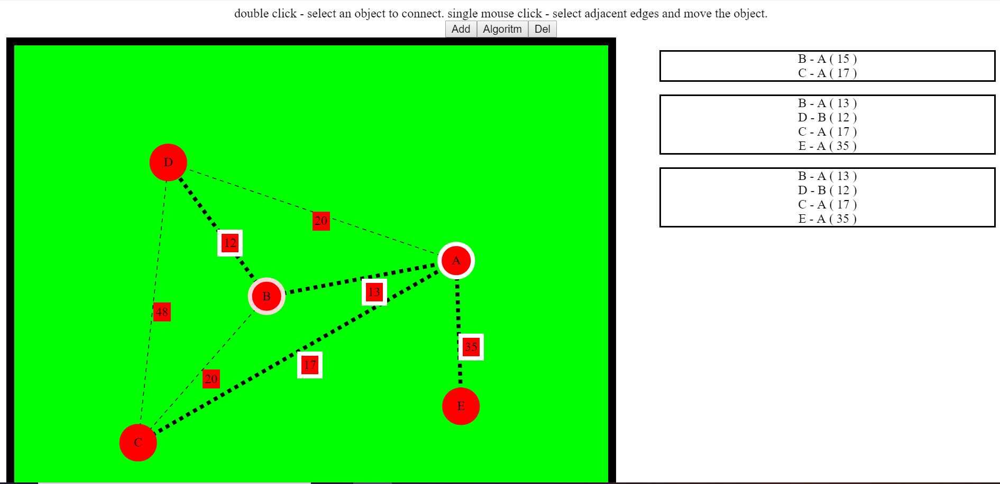
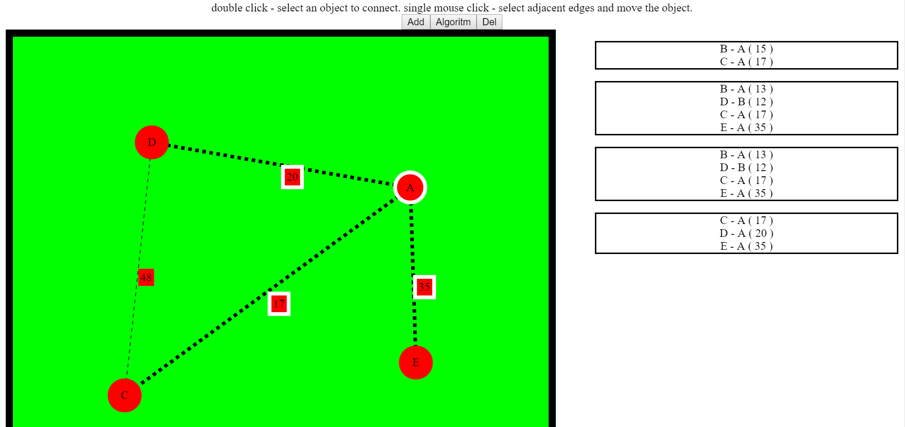

This project was bootstrapped with [Create React App](https://github.com/facebook/create-react-app).

## Algoritm Prima

Само [приложение](https://prim-alg.netlify.com/) в глобальной сети.

Для запуска:  
* npm install ( в самой дирректории )  
* npm start  

Кнопка Add - добавить вершину  
  
Чтобы провести ребро - двойной клик по одной из вершин (тогда она выделится белой окантовкой) затем двойной клик по второй. Сбросить выделенную вершину можно двойным кликом.  
  
Одинарный клик по вершине выделяет ее для перемещения, а так же выделяет ребра, повторный одинарный клик снимает выделение с ребер, но вершину все так же можно передвигать.  
  
Кнопка Algoritm - запустить алгоритм  
  
Кнопка Delete - удаляет выделенную вершину и смежные с ней ребра

## Пример работы программы  
  

